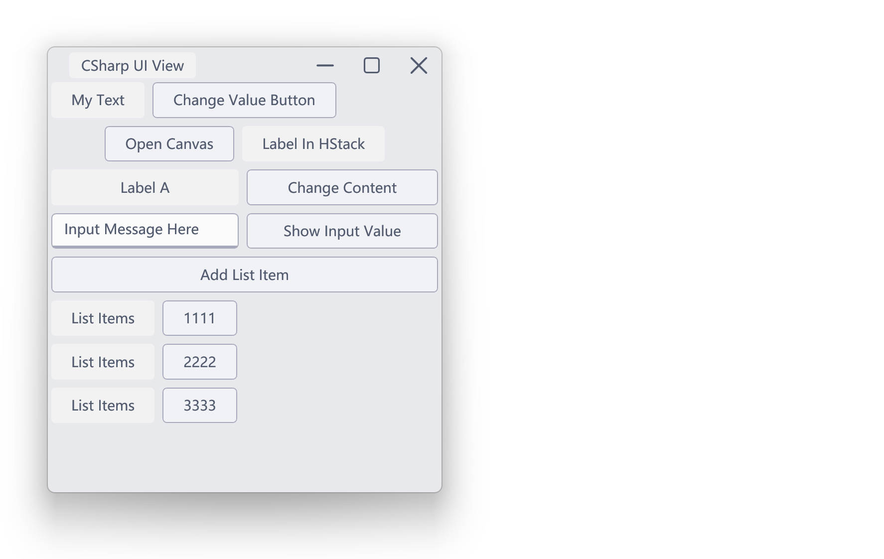

# SyminUI

SyminUI is a WPF UI kit. Build interface with Neomorphism style and **C#UI** in MVU pattern (WIP).\
SyminUI 是 WPF 的 UI 组件库，并使用称为 **C#UI** 的 MVU 设计模式进行 UI 搭建（画饼中），默认样式为新拟态风格。

[](https://github.com/syminomega/SyminUI/actions/workflows/dotnet-desktop.yml)

## Preview 总览


## 🧰 Quick Start 快速使用
1. Add `SyminData` and `SyminUI` reference to your project.\
在项目中添加 `SyminData` 和 `SyminUI` 引用.
2. Add these code to `App.xaml`.\
将以下代码添加至 `App.xaml` 中。

``` xml
    <Application.Resources>
        <ResourceDictionary>
            <ResourceDictionary.MergedDictionaries>
                <ResourceDictionary Source="pack://application:,,,/SyminUI;component/Themes/SyminLight.xaml"/>
                <ResourceDictionary Source="pack://application:,,,/SyminUI;component/Themes/SyminBasic.xaml"/>
                <ResourceDictionary Source="pack://application:,,,/SyminUI;component/Themes/SyminStyle.xaml"/>
                <ResourceDictionary Source="pack://application:,,,/SyminUI;component/Themes/SyminExtra.xaml"/>
            </ResourceDictionary.MergedDictionaries>
        </ResourceDictionary>
    </Application.Resources>
```
## 🛠️ MVU Design (Working In Progress)

Introducing the new way to design the user interface.\
使用全新的设计模式制作用户界面！

```c#
public class TestView : ViewContainer
    {
        /// <summary>
        /// 提供视图
        /// </summary>
        public override IView ViewProvider => MainView;

        readonly State<string> myText = "My Text";

        //测试可切换控件
        readonly State<IView> dynamicView = new Label("Label A");
        readonly State<string> inputText = "Input Message Here";

        readonly ObservableCollection<string> textCollection = new()
        {
            "1111",
            "2222",
            "3333"
        };

        public VStack MainView => new VStack
        {
            new HStack
            {
                new Label(myText),
                new Button("Change Value Button")
                    .OnClick(() => { myText.Value = "Text Changed!"; })
            },
            new HStack
            {
                new Button("Open Canvas")
                    .OnClick(() =>
                    {
                        CanvasTestWindow testWindow = new();
                        testWindow.Show();
                    }),
                new Label("Label In HStack"),
            }.HorizontalAlignment(HorizontalAlignment.Center),
            new Grid()
                {
                    new ContentView(dynamicView)
                        .GridLayout(0, 0),
                    new Button("Change Content")
                        .OnClick(() => { dynamicView.Value = new Label("Changed View"); })
                        .GridLayout(0, 1),
                    new InputField(inputText)
                        .GridLayout(1, 0),
                    new Button("Show Input Value")
                        .OnClick(() => MessageBox.Show(inputText.Value))
                        .GridLayout(1, 1),
                }
                .Cols("2*", ("*", 200, 400))
                .Rows("auto", "auto"),
            new Button("Add List Item")
                .OnClick(TestCollection),
            new ItemsView()
                .Foreach(textCollection, x => new HStack
                {
                    new Label("List Items"),
                    new Button(x),
                })
        };

        private void TestCollection()
        {
            textCollection.Insert(1, "Inserted Item");
        }
    }
```


## ⚠ Known Issues 已知问题
+ Slider view tick placement does not work.\
滑条的指示器样式未设计。
+ MenuItem disabled style is not finished.\
菜单按钮禁用样式尚未完善。
+ ListBox Header may not fit the row length.\
ListBox的头部可能和内容没法对齐。

## 📄 License 许可证
[The MIT License](./LICENSE)