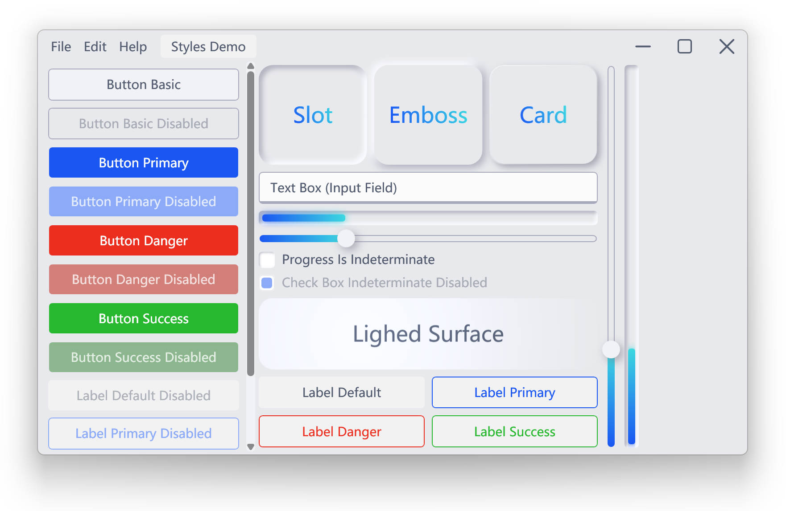
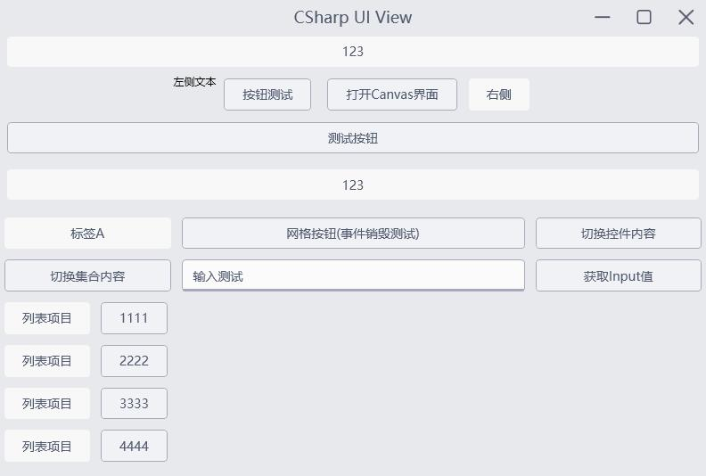
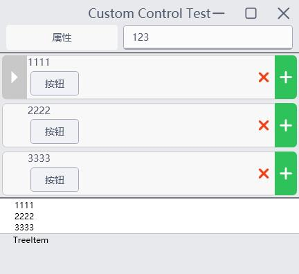

# SyminUI

SyminUI is a WPF UI kit. Build interface with Neomorphism style and **C#UI** in MVU pattern (WIP).\
SyminUI 是 WPF 的 UI 组件库，并使用称为 **C#UI** 的 MVU 设计模式进行 UI 搭建（画饼中），默认样式为新拟态风格。

## Preview 预览 (2022-05-29)
Currently is in early preview stage. **Pull requests are not available at this moment.**\
目前处于早期预览阶段，**Pull Request 暂未全面开放**。

## License 许可证
[The MIT License](./LICENSE)